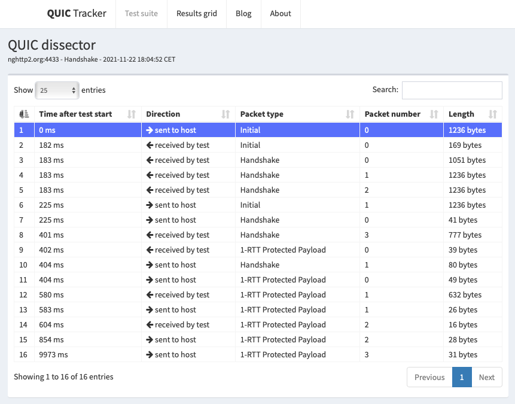
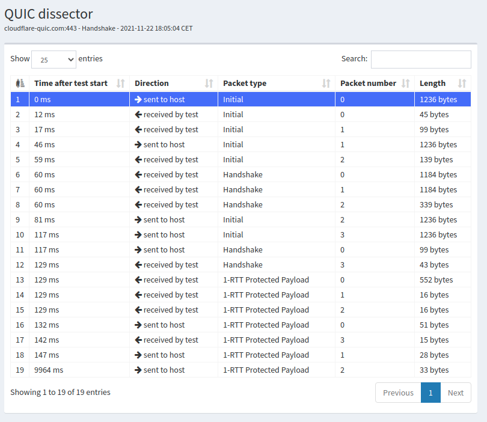
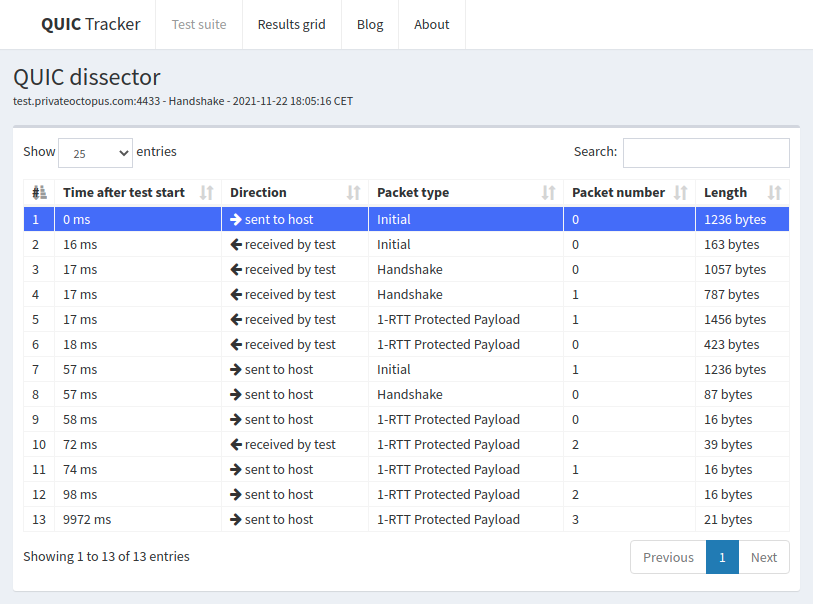
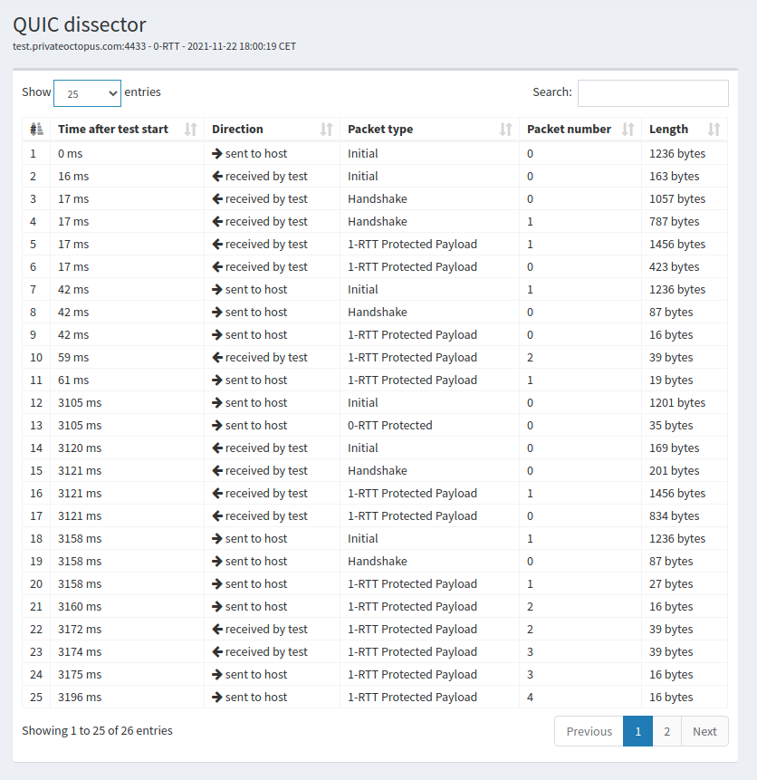
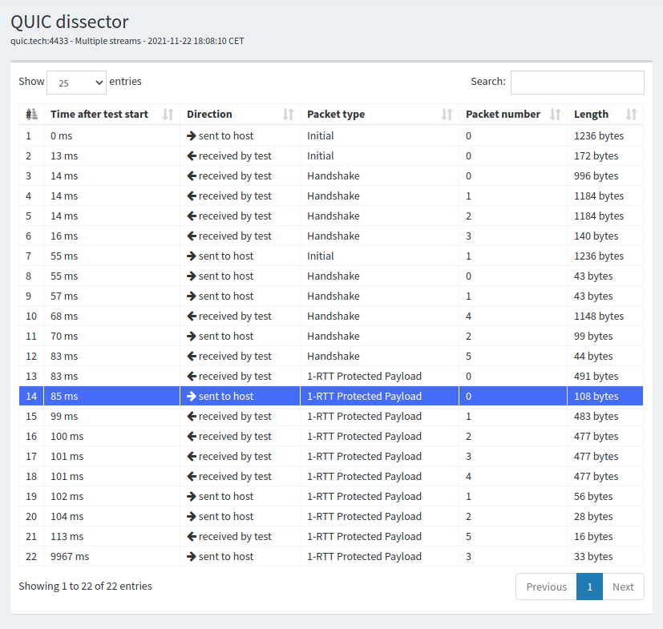

.. _chapter-quic:

QUIC
****

QUIC :cite:`rfc9000` is the latest transport protocol standardized by the IETF. There are several characteristics that distinguish QUIC from other transport protocols:

 - QUIC supports multiple byte streams like SCTP
 - QUIC includes various reliability and congestion control mechanisms like TCP
 - QUIC directly integrates the security features of TLS 1.3 :cite:`rfc8446` instead of simply layering TLS above the transport layer
 - QUIC can also be used to carry datagrams :cite:`draft-ietf-quic-datagram`
 - QUIC runs above UDP in contrast with other transport protocols such as TCP, SCTP or DCCP that run above IP   

.. spelling:word-list::

   datagrams
   crypto

   

From a pure layering viewpoint, QUIC can be illustrated as shown in :numref:`fig-quic-layers`.
   
.. _fig-quic-layers:
.. tikz:: QUIC in the TCP/IP stack
   :libs: fit, positioning
	  
   \begin{tikzpicture}[
   node distance = 1mm and 0mm,
   box/.style = {draw, text width=#1, inner sep=2mm, align=center},
   box/.default = 38mm,
   FIT/.style = {draw, semithick, dotted, fit=#1,
                 inner xsep=4mm, inner ysep=2mm},  
		 label distance = 2mm,
		 font = \sffamily
                 ]
		 
   \node (phy1) [box]                   {Phys.};
   \node (dl1) [box, above = of phy1]   {Data Link};
   \node (net1) [box, above = of dl1]   {IP};
   \node (transport1) [box, above = of net1]   {UDP};
   \node (transport2) [box, color=red, dashed, above = of transport1]   {reliable};
   \node (app) [box, color=red, dashed, above = of transport2]   {TLS};

   \end{tikzpicture}

It is unusual to layer a transport protocol above another one. QUIC opted for this solution for two main reasons. First, on most operating systems, any application can directly use UDP without requiring special privileges. This implies that QUIC can be implemented as a library which can be included directly inside applications. This contrasts with TCP, SCTP or DCCP whose implementations are either part of the operating system kernel or need special privileges to send `raw` packets. The second motivation is that UDP (as well as TCP and ICMP) is supported by most middleboxes while many of them block transport protocols that were not defined when they were designed :cite:`barik2020usability`.

It is useful to note that by using UDP, QUIC slightly increases its overhead. Each QUIC packet carries 8 bytes of headers containing the source and destination ports, the length field and a checksum. UDP also comes with a performance penalty compared to TCP. During the last decades, operating system kernels have been optimized to provide high bandwidth using TCP with techniques such as TCP Segmentation Offload (TSO) and Generic Receive Offload (GRO). In parallel, the UDP implementation has not changed significantly and most of the optimizations focused on request-response services such as DNS servers. The situation has changed recently with some effort, notably on Linux, to improve UDP's raw throughput :cite:`de2018optimizing`.

Frames and packets
==================

There is an important difference between QUIC and classical protocols like TCP or UDP. TCP and UDP send segments that are composed of a header followed by a sequence of bytes that constitutes the payload. In contrast and like SCTP, a QUIC packet contains a header followed by one or more frames. The QUIC header is much simpler and shorter than the TCP header. It only carries the information which is required in all QUIC packets. We will describe later the short and long QUIC headers. Each QUIC header starts with one byte that contains some flags and a 32 bits version field. QUIC defines different types of frames that we will discuss in this chapter. Some types of QUIC frames carry user data. Other types of QUIC frames carry control information. Some of these frames are used during the handshake only while others such as acknowledgments can be sent at any time. Each QUIC frame is a sequence of byte that starts with a one byte Type field. :numref:`fig-quic-packet` shows a QUIC packet containing two frames which is placed inside a UDP datagram. Neither the QUIC header nor the QUIC frames need to be aligned on 32 bits boundaries even if this alignment is convenient for :numref:`fig-quic-packet`. An important point to note is that a QUIC packet can mix both data and control frames in any order. 

.. _fig-quic-packet: 
.. tikz:: A QUIC packet is sent inside a UDP datagram and contains one or more QUIC frames
   :libs: positioning, matrix, arrows, math
	  
   \node (A) at (0,0)  {
   \definecolor{lightred}{rgb}{1,0.7,0.71}
   \begin{bytefield}{32}
   \bitheader{0-31} \\
   \begin{rightwordgroup}{UDP \\ Header}
   \bitbox{16}{Source Port} &  \bitbox{16}{Destination Port} \\
   \bitbox{16}{Length} & \bitbox{16}{Checksum} 
   \end{rightwordgroup} \\
   \begin{leftwordgroup}{QUIC\\Packet}
   \begin{rightwordgroup}{QUIC\\Header}
   \bitbox{8}{Flags} & \bitbox{24}{Version} \\
   \bitbox{8}{$...$} & \bitbox[tlr]{24}{$...$} \\
   \bitbox[lrb]{32}{$...$} 
   \end{rightwordgroup} \\
   \begin{rightwordgroup}{QUIC\\Frame 1}
   \bitbox{8}{Type} & \bitbox[tlr]{24}{$...$} \\
   \bitbox[lrb]{32}{$...$} 
   \end{rightwordgroup} \\
   \begin{rightwordgroup}{QUIC\\Frame 2}
   \bitbox{8}{Type} & \bitbox[tlr]{24}{$...$} \\
   \bitbox[lrb]{32}{$...$} 
   \end{rightwordgroup} \\
   \end{leftwordgroup} \\
   \end{bytefield}
   };

Connection establishment
========================

QUIC uses a four-way handshake to create a QUIC connection. :numref:`fig-quic-handshake` describes this handshake. The QUIC handshake has three main purposes. First, it allows to negotiate the crypto keys required to both encrypt and authenticate the packets that will be sent later on the connection. This is mainly done using TLS 1.3 :cite:`rfc8446`. Second, it allows to negotiate different options using transport parameters. Third, the server can validate that the client can respond to the address used to send the initial packet. This validation allows to prevent denial of service attacks using spoofed addresses.

.. _fig-quic-handshake:
.. tikz:: Simplified QUIC Handshake
   :libs: positioning, matrix, arrows, math

   \begin{tikzpicture}	  
   \tikzmath{\c1=1;}
   \tikzmath{\mmax=6.0;}

   \tikzmath{\c2=1.5;}
   \tikzmath{\s1=8;}
   \tikzmath{\s2=8.5;}

   \tikzstyle{every node}=[font=\small]
   \tikzstyle{arrow} = [thick,->,>=stealth]
   \tikzset{state/.style={rectangle, dashed, draw, fill=white} }
   \node [black, fill=white] at (\c1,\mmax) {Client};
   \node [black, fill=white] at (\s1,\mmax) {Server};
   
   \draw[black,thick,->] (\c1,\mmax-0.5) -- (\c1,0.5);
   \draw[black,thick,->] (\s1,\mmax-0.5) -- (\s1,0.5);
   
   \tikzmath{\y=\mmax-1;}
   
   \draw[blue,thick, ->] (\c1,\y) -- (\s1,\y-0.9) node [midway, fill=white]  {Initial (CRYPTO)};
   \draw[blue,thick, ->] (\s1,\y-1) -- (\c1,\y-2) node [midway, align=center, fill=white] {Initial (CRYPTO)\\Handshake (CRYPTO)};
   \draw[blue,thick, ->] (\c1,\y-2.1) -- (\s1,\y-3.1) node [midway, fill=white] {Handshake (CRYPTO)};
   \draw[blue,thick, ->] (\s1,\y-3.1) -- (\c1,\y-4.1) node [midway, fill=white] {Handshake\_Done};

   \end{tikzpicture}

The client sends an ``Initial`` packet containing a ``CRYPTO`` frame. This packet carries the ``TLS Client Hello`` and the transport parameters proposed by the client for this connection. The server replies with an ``Initial`` packet containing also a ``CRYPTO`` frame. This one contains the ``TLS Server Hello``. It is immediately followed by one or more ``Handshake`` packets containing also a ``CRYPTO`` frame with the ``TLS Encrypted Extensions``. The contents of this frame is encrypted using the session key derived from the information contained in the ``TLS Client Hello`` and the ``TLS Server Hello``. It mainly contains the certificate and the transport parameters of the server. This frame can be spread over several QUIC packets. The client replies with a ``Handshake`` packet that contains a ``CRYPTO`` frame with the ``TLS Finished`` message. The server later confirms the end of the TLS handshake by sending a ``Handshake_Done`` frame.
   
   
Before looking at the details of the negotiation of the cryptographic parameters, it is interesting to see how QUIC counters denial of service attacks that use spoofed addresses. During such attack, host `x` sends packets using the address of host `y` as their source. The main risk of such attacks is that the server could send a large number of packets towards address `y` although the host owning this address did not try to establish a QUIC connection with the server. QUIC prevents such attacks by using two distinct techniques. First, and this is unusual for transport protocols, the Initial QUIC packet sent by the client is large. The first packet sent to create a QUIC connection must contain a UDP payload of at least 1200 bytes :cite:`rfc9000`. Such a packet contains a CRYPTO frame has shown in the figure, but also padding frames to fill the packet. If an attacker wants to send spoofed packets to initiate a connection with a server, it needs to send more than one KByte for each connection attempt. This should be compared with the 40 bytes of the TCP and IPv4 headers that must be sent to initiate a TCP connection. Another advantage of sending a large initial packet, the client can also perform Path MTU discovery and detect routers that could fragment the QUIC packets.

.. note:: Address spoofing

   In theory, an Internet host should only send packets using its IPv4 and IPv6 source addresses. In practice, incorrectly configured hosts can use other addresses than their assigned one. Furthermore, attackers often change their source address to hide some of their activities. A frequent situation are denial of service (DoS) attacks. A simple DoS attack is when a host sends a large volume of packets to a victim. If the attacker sends these packets using another address than its official IP address, it makes it more difficult for the victim to identify the source of the attack.

   But there is another category of DoS attack that is more worrisome. If an attacker can send a packets using the source address of the victim to a server, the server would return a response to the victim. These attackers use Internet servers that send a large response, possibly using multiple packets to a single request packet. They have exploited protocols such as DNS, NTP or applications such as `memcached <https://www.memcached.org/>`_ . The main problem with such attacks is that the server amplifies the volume of the attack generated by the clients. As there are very powerful servers on the Internet, this can be a huge problem and such attacks have reached volumes of hundreds of Gbps. The IETF and network operators have published recommendations to configure access networks to block spoofed packets :cite:`rfc2827`. Unfortunately, there are still portions of the Internet where attackers can send spoofed packets :cite:`luckie2019network`. 

The second mitigation against denial-of-service attacks using spoofed packets operates on the server. When a server receives an initial packet from a client, it may respond with an initial packet as shown in :numref:`fig-quic-handshake`. This could for example be the case of an enterprise server that receives a request from a host of a known enterprise subnet. The server could also want to validate the client and verify that the client can receive the packets that it sends. For this, it returns a Retry frame and a Token. This token is an opaque field that is constructed in a way that makes it easy for the server to validate the subsequent client packets and difficult for the client to predict the token that a server will create. A possible approach is to compute a secure hash of a message that contains the source IP addresses and ports used by the client, a secret value only known by the server and possibly some timing information to enable the server to ignore older tokens. Faced with the same problem, TCP `syn cookies` are encoded using fewer bits and thus inherently less secure. :numref:`fig-quic-handshake-retry` shows a QUIC handshake that includes a validation of the client address. 

.. _fig-quic-handshake-retry:
.. tikz:: Simplified QUIC Handshake with address validation
   :libs: positioning, matrix, arrows, math

   \tikzmath{\c1=1;\c2=1.5; \s1=8; \s2=8.5; \mmax=8; }
   \tikzstyle{every node}=[font=\small]
   \tikzstyle{arrow} = [thick,->,>=stealth]
   \tikzset{state/.style={rectangle, dashed, draw, fill=white} }
   \node [black, fill=white] at (\c1,\mmax) {Client};
   \node [black, fill=white] at (\s1,\mmax) {Server};
   
   \draw[black,thick,->] (\c1,\mmax-0.5) -- (\c1,0.5);
   \draw[black,thick,->] (\s1,\mmax-0.5) -- (\s1,0.5);
   
   \tikzmath{\y=\mmax-1;}
   
   \draw[blue,thick, ->] (\c1,\y) -- (\s1,\y-1) node [midway, fill=white]  {Initial (CRYPTO)};
   \draw[red,thick, ->] (\s1,\y-1) -- (\c1,\y-2) node [midway, fill=white] {Retry+Token};
   \draw[blue,thick, ->] (\c1,\y-2) -- (\s1,\y-3) node [midway, fill=white]  {Initial (CRYPTO)+Token};
   
   \draw[blue,thick, ->] (\s1,\y-3) -- (\c1,\y-4) node [midway, align=center, fill=white] {Initial (CRYPTO)\\Handshake (CRYPTO)};
   \draw[blue,thick, ->] (\c1,\y-4) -- (\s1,\y-5) node [midway, fill=white] {Handshake (CRYPTO)};
   \draw[blue,thick, ->] (\s1,\y-5) -- (\c1,\y-6) node [midway, fill=white] {Handshake\_Done};

Address validation improves the resilience of servers against denial of service attacks using spoofed addresses, but this comes at the expense of a longer connection establishment delay. QUIC version 1 includes several additional techniques to reduce the impact of address validation while still preventing denial of service attacks. 

Identifying QUIC connections
----------------------------

A TCP connection is identified by a four tuple :math:`IP_{Client},IP_{Server},Port_{Client},Port_{Server}`. All packets belonging to a given connection carry this information in their IP and TCP headers. As QUIC runs above UDP, a simple approach could have been to use the UDP four tuple to identify each QUIC connection. Although simple, this solution would have severely restricted the flexibility of QUIC and the scalability of QUIC servers. The QUIC designers have opted for locally unique connection identifiers (CID) that are selected by the client and the server. These identifiers are placed in the QUIC packet headers during the handshake. When sending the Initial packet, the client selects a source CID that uniquely identifies the connection on the client and a random destination CID. Upon reception of this packet, the server selects its own connection identifier. It echoes the client selected CID and returns its selected CID. This is illustrated in :numref:`fig-quic-handshake-cid`. 

.. _fig-quic-handshake-cid:
.. tikz:: Connection identifiers during a simplified QUIC Handshake
   :libs: positioning, matrix, arrows, math

   \tikzmath{\c1=1;\c2=1.5; \s1=8; \s2=8.5; \mmax=4.5; }
   \tikzstyle{every node}=[font=\small]
   \tikzstyle{arrow} = [thick,->,>=stealth]
   \tikzset{state/.style={rectangle, dashed, draw, fill=white} }
   \node [black, fill=white] at (\c1,\mmax) {Client};
   \node [black, fill=white] at (\s1,\mmax) {Server};
   
   \draw[black,very thick,->] (\c1,\mmax-0.5) -- (\c1,0.5);
   \draw[black,very thick,->] (\s1,\mmax-0.5) -- (\s1,0.5);
   
   \tikzmath{\y=\mmax-1;}
   
   \draw[blue,thick, ->] (\c1,\y) -- (\s1,\y-1) node [midway, fill=white,align=center]  {\small [SCID=$x$, DCID=$y$] \\Initial};
   \draw[blue,thick, ->] (\s1,\y-1.2) -- (\c1,\y-2.2) node [midway, fill=white,align=center] {\small [SCID=$z$, DCID=$x$] \\ Initial \\Handshake};

The connection identifiers selected by the client and the server uniquely identify the QUIC connection. However, in contrast with TCP and UDP, the two identifiers are not present in all packets. Since a host selects a unique identifier for each connection, it only needs this identifier to identify a connection to which a packet belongs. For this reason, the QUIC packets exchanged on a connection after the handshake only contain the destination CID, i.e. the CID selected by the host that receives the packet. 

.. note:: Variable length CIDs

   Most transport protocols rely on fixed-length fields because this simplifies the parsing of packet headers. For example, the TCP and UDP port numbers are encoded as a 16 bits field. However, using fixed-length fields also limits the extensibility of the protocol. A TCP server cannot listen to more than :math:`2^{16}` different ports.

   QUIC has opted for variable length CIDs to support very different use cases. On the server side, the length of the selected connection identifiers will depend on the architecture of the server. Large sites might use a load balancer that distributes the connections to different physical servers. Such a load-balancer can leverage the CID to direct each incoming packet to the server that handles this connection. A simple CID would be composed of a server identifier chosen by the load balancer, e.g. in the high order bits of the CID, followed by a connection identifier selected by the physical server. Other designs are possible, e.g. by encrypting the CID to prevent attacks where malicious clients try to target a specific server.

   One the client side, variable lengths CIDs bring another benefit. As clients typically manage a small number of QUIC connections, they can simply rely on the destination port of the packets that they receive to identify the corresponding QUIC connection. This corresponds to a zero-length connection identifier. Such a CID is never sent by the server after the handshake. This limits the byte overhead of the packets that clients receive. 

   A last point to note about these CIDs is their encoding inside the QUIC packets. The Initial packet contains the length and the value of both connection identifiers. The maximum length for a CID is 20 bytes. However, after the handshake, the packets that are exchanged over the QUIC connection only contain the destination CID without any field indicating its length. The host that has allocated the CID knows the length of the CIDs that it uses and can thus parse the packets that it receives without an explicit length information. 
   	  

.. spelling:word-list::

   balancer
   stateful

   
Security keys
-------------
   
We can now discuss how QUIC leverages TLS 1.3 to negotiate the security keys that are used to authenticate and encrypt the packets exchanged over a connection. As shown in :numref:`fig-quic-handshake`, a QUIC connection starts with the exchange of four frames which can be carried in four or more packets. The first packet sent by the client contains the ``ClientHello`` TLS record. The ``ClientHello`` contains the information required to derive the session keys using Diffie-Hellman or a similar protocol. TLS 1.3 supports both finite field Diffie-Hellman and Elliptic Curve Diffie-Hellman :cite:`rfc8446`. The ``ClientHello`` message also contains TLS or QUIC parameters that the client proposes to use during the connection. The ``TLS Server Hello`` returned by the server contains the certificate that enables the client to validate the server's identity and the information required to determine the Diffie-Hellman keys. Using these keys, the server also encrypts the ``TLS Encrypted Extensions`` message that contains the TLS and QUIC parameters that the server has selected based on the ones proposed in the ``ClientHello``. The server also constructs the ``Finished`` message that contains a message authentication code computed over the entire TLS handshake. This message is encrypted and authenticated using the session keys derived from the Diffie-Hellman keys. The client and the server recompute the hash of the entire handshake and verify both ``Finished`` messages. If one of these messages is incorrect, this indicates that either the key has not been correctly derived or that some of the TLS messages have been tampered. In these situations, the QUIC connection is terminated with an error message. The simplified TLS handshake used by QUIC is illustrated in :numref:`fig-quic-tls-handshake`. The TLS messages shown in italics are encrypted using the session keys.

.. _fig-quic-tls-handshake:
.. tikz:: Simplified TLS Handshake within a QUIC connection 
   :libs: positioning, matrix, arrows, math

   \tikzmath{\c1=1;\c2=1.5; \s1=8; \s2=8.5; \mmax=6; }
   \tikzstyle{every node}=[font=\small]
   \tikzstyle{arrow} = [thick,->,>=stealth]
   \tikzset{state/.style={rectangle, dashed, draw, fill=white} }
   \node [black, fill=white] at (\c1,\mmax) {Client};
   \node [black, fill=white] at (\s1,\mmax) {Server};
   
   \draw[black,very thick,->] (\c1,\mmax-0.5) -- (\c1,0.5);
   \draw[black,very thick,->] (\s1,\mmax-0.5) -- (\s1,0.5);
   
   \tikzmath{\y=\mmax-1;}
   
   \draw[blue,thick, ->] (\c1,\y) -- (\s1,\y-1) node [midway, fill=white]  {TLS Client Hello};
   \draw[blue,thick, ->] (\s1,\y-1) -- (\c1,\y-2) node [midway, fill=white, align=center] {TLS Server Hello\\$EncryptedExtensions$\\$Finished$};
   \draw[blue,thick, ->] (\c1,\y-2.2) -- (\s1,\y-3.2) node [midway, fill=white]  {$Finished$};
   
   \draw[blue,thick, ->] (\s1,\y-3.2) -- (\c1,\y-4.2) node [midway, align=center, fill=white] {$Handshake\_Done$};

.. note:: Encrypting ``TLS Client Hello`` and ``TLS Server Hello``

   When TLS 1.3 is used above TCP, the ``TLS Client Hello`` and ``TLS Server Hello`` messages are sent in clear because the client and the server have not yet exchanged the session keys. A similar approach could have been used for QUIC, but there was a fear that middleboxes could analyze the contents of these initial QUIC messages and try to interfere with them. To add some burden on these middleboxes, QUIC encrypts the Initial packets using a secret that is derived from the destination connection ID of the client's first Initial packet. The pseudocode below, extracted from :cite:`rfc9001`, shows how the client and the server keys are derived:

   .. code-block:: python

      initial_salt = 0x38762cf7f55934b34d179ae6a4c80cadccbb7f0a
      initial_secret = HKDF-Extract(initial_salt,
                              client_dst_connection_id)

      client_initial_secret = HKDF-Expand-Label(initial_secret,
		   "client in", "", Hash.length)
      server_initial_secret = HKDF-Expand-Label(initial_secret,
                                 "server in", "",Hash.length)

   Since the keys used to protect the Initial packets are derived from the destination connection ID, any QUIC implementation, including those used on middleboxes, can decrypt the contents of the Initial packets.

    
As mentioned earlier, the client and the server can also use the TLS handshake to agree on specific QUIC parameters. These parameters are called `transport parameters` in QUIC :cite:`rfc9000`. 17 different transport parameters are defined in QUIC version 1 :cite:`rfc9000` and implementations can define their own transport parameters. We will discuss some of them in different sections of this document. A first example is the ``max_udp_payload_size`` parameter that indicates the largest UDP payload that an implementation is willing to receive. The minimum value for this parameter is 1200 bytes. QUIC implementations used in a datacenter supporting jumbo Ethernet frames could agree on a much larger ``max_udp_payload_size`` without risking packet fragmentation.

Another example of QUIC transport parameters are the ``initial_source_connection_id`` and the ``original_destination_connection_id`` transport parameters. As explained above, thanks to the ``Finished`` messages in the TLS handshake, the client and the servers can verify that their messages have not been tampered. Unfortunately, the authentication code included in the ``Finished`` messages is only computed based on the contents of the TLS messages (i.e. ``ClientHello``, ``ServerHello``, ``EncryptedExtensions`` and ``Finished``). During the handshake, the client and the servers also propose the source and destination connection identifiers that they plan to use to identify the QUIC session. These identifiers are placed in the packet header and not inside the TLS messages. They are thus not covered by the authentication code included in the ``Finished`` message. To still authenticate these identifiers, QUIC encodes them as transport parameters that are included in the ``ClientHello`` and the ``EncryptedExtensions`` messages. The client copies the source connection identifier in the ``initial_source_connection_id`` transport parameter in its ``ClientHello``. The server does the same when sending the ``ServerHello``. It also copies in the ``original_destination_connection_id`` transport parameter the destination identifier used by the client to send the packet containing the ``ClientHello``.

.. exercice: figure 8 de rfc9000

The QUIC packet headers
-----------------------
   
At this point, the QUIC session and the TLS security keys are known by the client and the server. They can start to exchange data. Before looking at how data is carried inside QUIC packets, it is interesting to explore in more details the packet headers that are placed inside each packet. QUIC uses variable length packet headers. Two different header formats exist. The first header format is the long header. This is the header used for the first packets of a QUIC connection.

Internet protocol specifications usually contain figures to represent the format of the packet headers. This graphical format is useful to get a quick grasp at a header containing fixed size fields. However, when a header contains several variable length fields, the graphical representation can become difficult to follow. The QUIC specification :cite:`rfc9000` uses the textual representation that was also used for the TLS protocol. As an example, let us consider the well-known TCP header. This header is graphically represented as shown in :numref:`fig-quic-tcp-header`. 

.. _fig-quic-tcp-header: 
.. tikz:: Graphical representation of the TCP header 

   \node (A) at (0,0)  {
   \definecolor{lightred}{rgb}{1,0.7,0.71}
   \begin{bytefield}{32}
   \bitheader{0-31} \\
   \bitbox{16}{Source Port} &  \bitbox{16}{Destination Port} \\
   \bitbox{32}{Sequence number} \\
   \bitbox{32}{Acknowledgment number } \\   
   \bitbox{4}{Offset} & \bitbox{6}{Res} & \bitbox{1}{\tiny U\\R\\G} & \bitbox{1}{\tiny A\\C\\K} & \bitbox{1}{\tiny P\\S\\H} & \bitbox{1}{\tiny R\\S\\T} & \bitbox{1}{\tiny S\\Y\\N} & \bitbox{1}{\tiny F\\I\\N} & \bitbox{16}{Window} \\
   \bitbox{16}{TCP Checksum} &  \bitbox{16}{Urgent Pointer} \\
   \end{bytefield}
   };
   
.. code-block:: console
   :caption: Textual representation of the TCP header
   :name: fig-quic-tcp-text-header

   TCP Header Packet {
     Source Port (16),
     Destination Port (16),
     Sequence Number (32),
     Acknowledgment Number (32),
     Offset (4),
     Reserved (6),
     Urgent Flag (1),
     ACK Flag (1),
     Push Flag (1),
     RST Flag (1),
     SYN Flag (1),
     FIN Flag(1),
     Window (16),
     TCP Checksum (16),
     Urgent Pointer (16),
     TCP Options (..)
   }
   
The attentive reader will easily understand the correspondence between the two formats. When explaining QUIC, we use the textual representation while we stick to the graphical one for TCP.
	 
	 
:numref:`fig-quic-long-header` shows the QUIC long header. It starts with one byte containing the header type in the most significant bit, two bits indicating the packet type and four bits that are specific to each packet packet. Then, 32 bits carry the QUIC version number. The current version of QUIC, defined in :cite:`rfc9000`, corresponds to version ``0x00000001``. The header then contains the destination and source connection identifiers that were described previously and then a payload that is specific to each type. 

.. code-block:: console
   :caption: The QUIC long header
   :name: fig-quic-long-header

   Long Header Packet {
     Header Form (1) = 1,                  /* high order bit of the first byte */
     Fixed Bit (1) = 1,                    /* second order bit of the first byte */
     Long Packet Type (2),                 /* third and fourth high order bits of the first byte */
     Type-Specific Bits (4),               /* low order four bits of the first byte */
     Version (32),                         /* 32 bits version number */
     Destination Connection ID Length (8), /* 8 bits */
     Destination Connection ID (0..160),   /* variable number from 0 up to 160 bits */
     Source Connection ID Length (8),
     Source Connection ID (0..160),
     Type-Specific Payload (..),           /* variable length */
   }

.. note:: Encoding packet numbers

   Most transport protocols use fixed fields to encode packet numbers or byte offsets. The size of this field is always a trade-off. On one hand, a small packet number field limits the per packet overhead. On the other hand, a large packet number space is required to ensure that two packets carrying different data do not use the same packet number. TCP uses a 32 bits sequence number field that indicates the position of the first byte of the payload in the bytestream. This 32 bits field became a concern as bandwidth increased to Gbps and beyond :cite:`rfc7323`.

   QUIC takes a different approach to sequence numbers. Each packet contains a per-packet sequence number. This number is encoded as a variable-length integer (``varint``). Such a ``varint`` has a length encoded in the two most significant bits of the first byte. If these bits are set to ``00``, then the ``varint`` is encoded in one byte and can contain values between :math:`0` and :math:`2^{6}-1`.  If the two most significant bits are set to ``01``, the ``varint`` can encode values between :math:`0` and :math:`2^{14}-1` within two bytes. When the two high order bits are set to ``11`` the ``varint`` can encode values between :math:`0` and :math:`2^{62}-1` within four bytes.

   There are other important differences between QUIC and other transport protocols when considering packet numbers. First, a QUIC sender must *never* reuse the same packet number for two different packets sent over a QUIC connection. If data needs to be retransmitted, it will be resent as a frame inside a new packet. Furthermore, since the largest possible packet number is :math:`2^{62}-1`, a QUIC sender must close the corresponding connection once it has sent a QUIC packet carrying this packet number. This puts a restriction on the duration of QUIC connections. They cannot last forever in contrast to TCP connections such as those used to support BGP sessions between routers. An application that uses QUIC must be ready to restart a connection from time to time.

   
This long header is used for the ``Initial``, ``Handhsake`` and ``Retry`` packets. Some of these packet types add new flags in the first byte and additional information after the connection identifiers. :numref:`fig-quic-initial-header` shows the long header of the ``Initial`` packet. It contains two bits in the first byte that indicate the length of the packet number field. The packet specific part contains an option token, a length field, a packet number and a payload. The token length, length and packet number are encoded using variable length integers. 

.. code-block:: console
   :caption: The QUIC long header of the Initial packet
   :name: fig-quic-initial-header
		
   Initial Packet {
     Header Form (1) = 1,                   /* High order bit first byte */
     Fixed Bit (1) = 1,
     Long Packet Type (2) = 0,
     Reserved Bits (2),
     Packet Number Length (2),              /* Low order 2 bits of first byte */
     Version (32),
     Destination Connection ID Length (8),
     Destination Connection ID (0..160),
     Source Connection ID Length (8),
     Source Connection ID (0..160),
     Token Length (i),
     Token (..),
     Length (i),
     Packet Number (8..32),
     Packet Payload (8..),
   }
		

The QUIC short header contains fewer fields. The most significant bit of the first byte is set to 1 to indicate that the packet carries a short header. The other flags will be discussed later. The two least significant bits of this byte contain the length of the packet number field. It is interesting to note that in contrast with the long header, there is no explicit indication of the length of the destination connection identifier. This connection identifier has been assigned by the host that receives this packet and it already knows the length of the connection identifiers that it uses.  

.. code-block:: console
   :caption: The QUIC short header used by 1-RTT packets
   :name: fig-quic-short-header
	  
   1-RTT Packet {
      Header Form (1) = 0,                /* High order bit of first byte */
      Fixed Bit (1) = 1,
      Spin Bit (1),
      Reserved Bits (2),
      Key Phase (1),
      Packet Number Length (2),           /* Low order bits of first byte */
      Destination Connection ID (0..160),
      Packet Number (8..32),
      Packet Payload (8..),
   }
   

The short header format, depicted in :numref:`fig-quic-short-header`, is used by all QUIC packets once the session keys have been derived. This usually happens after one round-trip-time. These packets are called the 1-RTT packets in the QUIC specification :cite:`rfc9000`. This notation is used to emphasize the fact that QUIC also supports 0-RTT packets, i.e. packets that carry data and can be exchanged in parallel with the TLS handshake.

.. note:: Coalescing packets

   Besides the connection identifiers, another difference between the short and the long headers is the presence of the ``Packet Length`` field in the long header. This field might surprise the reader who is familiar with UDP since UDP also contains a Length field. As each QUIC packet is placed inside a UDP message, the QUIC Length field could seem redundant. This Length field was included in the QUIC long header to allow a QUIC sender to coalesce several consecutive and small packets inside a single UDP message. Some of the frames exchanged during the handshake are rather small. Sending a UDP message for each of these frames would be a waste of resources. Furthermore, a mix of ``Initial``, ``Handshake`` and ``0-RTT`` packets are exchanged when creating a QUIC connection. It would not be wise to require the utilization of one UDP message to send each of these packets. You might observe this optimization when analyzing packet traces collected on QUIC servers.
   	  

.. spelling:word-list::

   pre
   ack
   

0-RTT data
----------

Latency is a key concern for transport protocols. The QUIC/TLS handshake that we have described until now allows the client and the server to agree on security keys within one round-trip-time. However, one round-trip-time can be a long delay for some applications. To minimize the impact of the connection setup time, QUIC allows applications to exchange data during the QUIC/TLS handshake. Such data is called 0-RTT data. To ensure that 0-RTT data is exchanged securely, the client and the server must have previously agreed on a key which can be used to encrypt and authenticate the 0-RTT data. Such a 0-RTT key could either be a pre-shared key that the client and the server have shared without using the QUIC protocol or, and this is the most frequent solution, the key that they negotiated during a previous connection. In practice, the server enables 0-RTT by sending a TLS session ticket to the client :cite:`rfc8446`. A session ticket is an encrypted record that contains information that enables the server to recover all the state information about a session including its session keys. It is also linked to the client's address to enable the server to verify that a given client reuses the tickets that it has received earlier. Usually, these tickets also contain an expiration date. The client places the received ticket in the ``TLS CLient Hello`` that it sends in the first ``Initial`` packet. It uses the pre-shared key corresponding to this ticket to encrypt data and place it in one or more ``0-RTT`` packets. The server uses the information contained in the ticket to recover the key and decrypt the data of the ``0-RTT`` packet. :numref:`fig-quic-0-rtt-packet` shows the format of QUIC's 0-RTT packet. 
   
   

.. code-block:: console
   :caption: The QUIC 0-RTT packet
   :name: fig-quic-0-rtt-packet

   0-RTT Packet {
     Header Form (1) = 1,                  /* High order bit of the first byte */
     Fixed Bit (1) = 1,
     Long Packet Type (2) = 1,
     Reserved Bits (2),
     Packet Number Length (2),            /* Low order bits of the first byte */
     Version (32),
     Destination Connection ID Length (8),
     Destination Connection ID (0..160),
     Source Connection ID Length (8),
     Source Connection ID (0..160),
     Length (i),
     Packet Number (8..32),
     Packet Payload (8..),
   }

The main benefit of these ``0-RTT`` packets is that the client can immediately send encrypted data while sending its ``Initial`` packet. This is illustrated in :numref:`fig-quic-handshake-Ortt` where the frames encrypted with the 0-RTT keys are shown in italics. Note that some of these frames can span several packets. ``0-RTT`` packets are only sent by the QUIC client since the server can send encrypted data immediately after having sent its ``Handshake`` frames. As explained earlier, the Initial packets are also encrypted but using keys derived from the connection identifiers. 

.. _fig-quic-handshake-Ortt:
.. tikz:: Simplified QUIC Handshake with 0-RTT data
   :libs: positioning, matrix, arrows, math

   \begin{tikzpicture}	  
   \tikzmath{\c1=1;\c2=1.5; \s1=8; \s2=8.5; \mmax=8; }
   \tikzstyle{every node}=[font=\small]
   \tikzstyle{arrow} = [thick,->,>=stealth]
   \tikzset{state/.style={rectangle, dashed, draw, fill=white} }
   \node [black, fill=white] at (\c1,\mmax) {Client};
   \node [black, fill=white] at (\s1,\mmax) {Server};
   
   \draw[black,thick,->] (\c1,\mmax-0.5) -- (\c1,0.5);
   \draw[black,thick,->] (\s1,\mmax-0.5) -- (\s1,0.5);
   
   \tikzmath{\y=\mmax-1;}
   
   \draw[blue,thick, ->] (\c1,\y) -- (\s1,\y-0.9) node [midway, fill=white]  {Initial (CRYPTO)};
   \draw[blue,thick, ->] (\c1,\y-0.5) -- (\s1,\y-1.4) node [midway, fill=white]  {$0-RTT (Data)$};
   \draw[blue,thick, ->] (\s1,\y-2) -- (\c1,\y-3) node [midway, align=center, fill=white] {Initial (CRYPTO)\\$Handshake (CRYPTO)$};
   \draw[blue,thick, ->] (\c1,\y-3.1) -- (\s1,\y-4.1) node [midway, fill=white] {$Handshake (CRYPTO)$};
   \draw[blue,thick, ->] (\s1,\y-4.1) -- (\c1,\y-5.1) node [midway, fill=white] {$Handshake\_Done$};

   \end{tikzpicture}

   

.. note:: Replay attacks and 0-RTT packets

   Thanks to the 0-RTT packets, a client can send encrypted data to the server before waiting for the secure handshake. This reduces the latency of the data transfer, but with one important caveat. QUIC does not provide any guarantee that 0-RTT data will not be replayed. QUIC's 0-RTT data exchanged is intended for idempotent operations. A detailed discussion of the impact of replay attacks may be found in :cite:`tls13-0rtt`.

   To understand the importance of these replay attacks, let us consider a simple HTTP GET request. Such a request could easily fit inside the 0-RTT packet and thus have lower latency. If a web browser uses it to request a static ``index.html`` file, there is no harm if the request is received twice by the server. However, if the GET request is part of a REST API and has side effects, then problems could occur depending on the type of side effect. Consider a REST API that allows a user to switch off the lights using his or her smartphone. Replaying this request two or three times will always result in the light being switched off. However, if the user requests to increase the room temperature by one °C, then multiple replays will obviously have different consequences.

Closing a QUIC connection
=========================

Before exploring how data can be exchanged over a QUIC connection, let us now analyze how a QUIC connection can terminate. QUIC supports three different methods to close a QUIC connection. QUIC's approach to terminating connection is very different from the approaches used by traditional transport protocol. Before looking at these techniques, it is important to understand how QUIC interacts with Network Address Translation.

.. note:: QUIC and Network Address Translation

   QUIC runs above UDP and the design of QUIC was heavily influenced by the presence of NATs. NATs, like other middleboxes, maintain per-flow state. For TCP connections, many NATs rely on the ``SYN``, ``FIN`` and ``RST`` flags to determine when state must be created or removed for a TCP connection. For UDP, this stateful approach is not possible and NATs create a new mapping when they observe the first packet of a flow and remove the mapping once the flow has been idle for sometime. The IETF recommends to maintain NAT mappings during at least two minutes :cite:`rfc4787`, but measurements show that some deployed NATs use shorter timeouts :cite:`richter2016multi,hatonen2010experimental`. In practice, UDP flows should probably send a packet every 30 seconds to ensure that the on-path NATs preserve their state.

   To prevent NATs from changing the mapping associated to the IP addresses and ports used for a QUIC connection, QUIC hosts will need to regularly send data over each established QUIC connection. QUIC defines a ``PING`` frame that allows any QUIC endpoint to send a frame that will trigger a response from the other peer. The ``PING`` frame does not carry data, but the receiver of a ``PING`` frame needs to acknowledge the packet containing this frame. This creates a bidirectional communication and can prevent NATs from discarding the mapping associated to the QUIC connection.

Implicit termination of QUIC connections
----------------------------------------
   
Each QUIC implementation keeps in its connection state the timestamp of the last QUIC packet received over this connection. During the connection establishment, the QUIC hosts can also exchange the ``max_idle_timeout`` parameter that indicates how long (in seconds) a QUIC connection can remain idle before being automatically closed. The first way to close a QUIC connection is to keep it idle for this period of time.

Explicit termination of a QUIC connection
-----------------------------------------

The second technique to terminate a QUIC connection is to use the ``CONNECTION_CLOSE`` frame. This frame indicates that this connection has been closed abruptly.  The host that receives the ``CONNECTION_CLOSE`` may respond with one ``CONNECTION_CLOSE`` frame. After that, it must stop sending any additional frame. It keeps the connection state for some time, but does not accept any new packet nor retransmit others. The host that sends a ``CONNECTION_CLOSE`` frame indicates that it will neither send nor accept more data. It keeps a subset of the QUIC connection state to be able to retransmit the ``CONNECTION_CLOSE`` frame if needed.

A host also sends a ``CONNECTION_CLOSE`` frame to abruptly terminate a connection if it receives an invalid frame or detects a protocol error. In this case, the ``CONNECTION_CLOSE`` frame contains a variable length integer that indicates the reason for the termination, the type of the frame that triggered the error and additional information encoded as a text string.

.. _fig-quic-connection-close:
.. tikz:: A server that refuses a connection
   :libs: positioning, matrix, arrows, math

   \begin{tikzpicture}	  
   \tikzmath{\c1=1;\c2=1.5; \s1=8; \s2=8.5; \mmax=4; }
   \tikzstyle{every node}=[font=\small]
   \tikzstyle{arrow} = [thick,->,>=stealth]
   \tikzset{state/.style={rectangle, dashed, draw, fill=white} }
   \node [black, fill=white] at (\c1,\mmax) {Client};
   \node [black, fill=white] at (\s1,\mmax) {Server};
   
   \draw[black,thick,->] (\c1,\mmax-0.5) -- (\c1,0.5);
   \draw[black,thick,->] (\s1,\mmax-0.5) -- (\s1,0.5);
   
   \tikzmath{\y=\mmax-1;}
   
   \draw[blue,thick, ->] (\c1,\y) -- (\s1,\y-0.9) node [midway, fill=white]  {Initial (CRYPTO)};
   \draw[blue,thick, ->] (\s1,\y-1) -- (\c1,\y-2) node [midway, align=center, fill=white] {Initial(CONNECTION\_CLOSE)};

   \end{tikzpicture}

The QUIC specification also defines a third technique called `stateless reset` to cope with hosts that have lost connection state after a crash or outage. It relies on a 16 bytes stateless token announced together with the connection identifier. See :cite:`rfc9000` for all the details.

Exchanging data over a QUIC connection
======================================

.. streams

The data exchanged over is QUIC connection is organized in different streams. A stream is a sequence of bytes. QUIC supports both unidirectional and bidirectional streams. Both the client and the server can create new streams over a QUIC connection. Each stream is identified by a stream identifier. To prevent problems when the client and the server try to create a stream using the same identifier, QUIC restricts the utilization of the stream identifiers based its two low-order bits. A QUIC client can only create streams whose two low order bits are set to ``00`` (bidirectional stream) or ``10`` (unidirectional stream). Similarly, the low order bits of the server-initiated streams must be set to ``01`` (bidirectional stream) or ``11`` (unidirectional streams). The QUIC streams are created implicitly by sending data over the stream with the chosen identifier. The stream identifiers start at the minimum value, i.e. ``0x00`` to ``0x03`` for the respective types. If a host sends stream data for stream ``x`` before having sent data over the lower-numbered streams of that type, then those streams are implicitly created. The stream identifier is encoded using a variable length integer. The largest possible stream identifier is thus :math:`2^{62}-1`.

QUIC places all data inside ``STREAM`` frames that are then placed inside QUIC packets. The structure of a ``STREAM`` frame is shown in :numref:`fig-quic-stream-frame`. This frame contains the following information :

 - the Type of the Stream frame [#f-stream-type]_
 - the identifier of the stream
 - the offset, i.e. the position of the first byte of the Stream data in the bytestream
 - the length of the data
 - the Stream Data

.. code-block:: console
   :caption: The QUIC STREAM frame
   :name: fig-quic-stream-frame

   STREAM Frame {
      Type (i) = 0x08..0x0f,
      Stream ID (i),
      Offset (i),
      Length (i),
      Stream Data (..),
   }

The ``STREAM`` frame carries data, but it can also terminate the corresponding stream. The lowest order bit of the Type field acts as a ``FIN`` bit. When set to zero, it indicates that subsequent data will be sent over this stream. When set to one, it indicates that the ``STREAM`` frame contains the last bytes sent over that stream. The stream is closed once the last byte of the stream has been delivered to the user application. Once a QUIC stream has been closed, it cannot be reused again over this connection.
   
Using this information, the receiver can easily reassemble the data received over the different streams. As an illustration, let us consider a server that has created two streams (stream ``1`` and ``5``). The server sends ``ABCD..`` over stream ``1`` and ``123`` over stream ``5`` and closes it after having sent the third digit. The data from these streams could be encoded as shown in :numref:`fig-quic-streams-example`.

.. code-block:: console
   :caption: Data sent over two different streams 
   :name: fig-quic-streams-example

   STREAM Frame {
      Type (i) = 0x0e,
      Stream ID = 1,
      Offset = 0
      Length = 2
      Stream Data = AB
   }
   STREAM Frame {
      Type (i) = 0x0e,
      Stream ID = 5,
      Offset = 0
      Length = 1
      Stream Data = 1
   }
   STREAM Frame {
      Type (i) = 0x0e,
      Stream ID = 1,
      Offset = 2
      Length = 1
      Stream Data = C
   }
   STREAM Frame {
      Type (i) = 0x0f,   /* FIN bit is set, end of stream */
      Stream ID = 5,
      Offset = 1
      Length = 2
      Stream Data = 23
   }
   STREAM Frame {
      Type (i) = 0x0e,
      Stream ID = 1,
      Offset = 3
      Length = 4
      Stream Data = DEFG
   }
   

The penultimate frame shown in :numref:`fig-quic-streams-example` has the ``FIN`` flag set. It marks the end of stream ``1`` that has transported three bytes in total. The ``FIN`` flag is the normal way to gracefully close a QUIC stream.

There are however cases where an application might need to cancel a stream abruptly without closing the corresponding connection. First, the sending side of a stream can decide to reset the stream. For this, it sends a ``RESET_STREAM`` frame that carries the identifier of the stream that is canceled. The receiving side of a stream might also need to stop receiving data over a given stream. Consider for example a web browser that has started to download the different images that compose a web while the user has already clicked on another page from the same server. The streams that correspond to these images become useless. In this case, our browser can send a ``STOP_SENDING`` frame to indicate that it discards the incoming data over the corresponding streams. Upon reception of this frame, the server sends a ``RESET_STREAM`` frame to indicate that the corresponding stream has been closed.

.. exemple stop sending et reset stream ?

Flow control in QUIC
--------------------

Transport protocols usually allocate some resources to each established connection. Each QUIC connection requires memory to store its state, but also buffers to store the packets arrived out-of-order. In practice, the memory available for QUIC implementations is not unlimited and a QUIC receiver must control the amount of packets that the remote host can send at any time. QUIC supports flow control techniques that operate at different levels.

The first level is the connection level.
During the handshake, each host can announce the maximum number of bytes that it agrees to receive initially on the connection using the ``initial_max_data`` transport parameter. This parameter contains the number of bytes that the sending host agrees to receive without further notice. If the connection uses more bytes than initially agreed, the receiver can update this limit by sending a ``MAX_DATA`` frame at any time. This frame contains a variable length integer that encodes the maximum amount of stream data that can be sent over the connection.

.. limits utilisées aujourd'hui ?

The utilization of different streams also consumes resources on a QUIC host. A receiver can also restrict the number of streams that the remote host can create. During the handshake, the ``initial_max_streams_bidi`` and ``initial_max_streams_uni`` transport parameters announce the maximum number of bidirectional and unidirectional streams that the receiving host can accept. This limit can be modified during the connection by sending a ``MAX_STREAMS`` frame that updates the limit.

.. limits utilisées aujourd'hui ?

Flow control can also take place at the stream level. During the handshake, several transport parameters allow the hosts to advertise the maximum number of bytes that they agree to receive on each stream. Different transport parameters are used to specify the limits that apply to the local/remote and unidirectional/bidirectional streams. These limits can be updated during the connection by sending ``MAX_STREAM_DATA`` frames. Each of these frames indicates the maximum amount of stream data that can be accepted on a given stream.

These limits restrict the number of streams that a host can create and the amount of bytes that it can send. If a host is blocked by any of these limits, it may sent a control frame to request the remote host to extend the limit. For each type of flow control, there is an associated control frame which can be used to request an extension of the limit.

A host should send a ``DATA_BLOCKED`` frame when it reaches the limit on the maximum amount of data set by the ``initial_max_data`` transport parameter or a previously received ``MAX_DATA`` frame. The ``DATA_BLOCKED`` frame contains the connection limit that caused the transmission to be blocked. In practice, a receiving host should increase the connection-level limit by sending ``MAX_DATA`` frames before reaching the limit. However, since this limit is function of the available memory, a host might not always be able to send a ``MAX_DATA`` frame. :numref:`fig-quic-example-max_data` provides an example packet flow with the utilization of these frames. We assume that the ``initial_max_data`` transport parameter was set to ``100`` bytes by the client during the handshake and the the server needs to send 900 bytes. The server creates a stream and sends 100 bytes in a ``1-RTT`` packet carrying a ``STREAM`` frame. At this point, the server is blocked. 

.. _fig-quic-example-max_data:
.. tikz:: QUIC uses ``DATA_BLOCKED`` frames when a connection's flow control is blocked 
   :libs: positioning, matrix, arrows, math

   \begin{tikzpicture}	  	  
   \tikzmath{\c1=1;\c2=1.5; \s1=8; \s2=8.5; \mmax=10; }
   \tikzstyle{every node}=[font=\small]
   \tikzstyle{arrow} = [thick,->,>=stealth]
   \tikzset{state/.style={rectangle, dashed, draw, fill=white} }
   \node [black, fill=white] at (\c1,\mmax) {Client};
   \node [black, fill=white] at (\s1,\mmax) {Server};
   
   \draw[black,thick,->] (\c1,\mmax-0.5) -- (\c1,0.5);
   \draw[black,thick,->] (\s1,\mmax-0.5) -- (\s1,0.5);
	  
   \tikzmath{\y=\mmax-1;}
   
   \draw[blue,thick, ->] (\s1,\y) -- (\c1,\y-1) node [midway, fill=white]  {1-RTT(STREAM,100 bytes)};
   \draw[blue,thick, ->] (\c1,\y-1) -- (\s1,\y-2) node [midway, align=center, fill=white] {1-RTT(ACK)};
   \draw[blue,thick, ->] (\s1,\y-2) -- (\c1,\y-3) node [midway, fill=white]  {1-RTT(DATA\_BLOCKED)};
   \draw[blue,thick, ->] (\c1,\y-3) -- (\s1,\y-4) node [midway, align=center, fill=white] {1-RTT(ACK)};
   \draw[blue,thick, ->] (\s1,\y-5) -- (\c1,\y-6) node [midway, fill=white]  {1-RTT(DATA\_BLOCKED)};
   \draw[blue,thick, ->] (\c1,\y-6) -- (\s1,\y-7) node [midway, align=center, fill=white] {1-RTT(ACK,MAX\_DATA(5000))};
   \draw[blue,thick, ->] (\s1,\y-7) -- (\c1,\y-8) node [midway, fill=white]  {1-RTT(STREAM,800 bytes)};

   \end{tikzpicture}

	  
The same applies with the ``STREAM_DATA_BLOCKED`` frame that is sent when a host reaching the per-stream limit. The ``STREAMS_BLOCKED`` frame is used when a host has reached the maximum number of established streams.

.. note:: Connections blocked by flow control are not totally idle

   If a QUIC host detects that a connection is blocked by flow control, it should regularly send ``DATA_BLOCKED`` or ``STREAM_DATA_BLOCKED`` frames to request the remote host to extend the current limit. The QUIC specification :cite:`rfc9000` does not recommend precisely how often these frames should be sent when a connection is blocked by flow control. Experience with QUIC deployments will enable the QUIC developers to more precisely define how often these frames should be sent.
	   

   A measurement study :cite:`marx2020same` revealed that QUIC implementations used different strategies for flow control. They identified three main types of behaviors :

     - Static Flow Control: the receive buffer size stays unchanged and the receiver simply increases the maximum allowance linearly
     - Growing Flow Control: the size of the receive buffer increases over time as the connection progresses
     - Auto-tuning: the size of the receive buffer is adjusted dynamically based on the estimated bandwidth and round-trip times

   In 2020, three quarter of the studied implementations used a Static Flow Control and only one used auto-tuning. Static Flow Control can work, but this is a waste of memory. For example, Google's Chrome starts with a 15 MBytes receive buffer and updates it linearly :cite:`marx2020same`. This should be contrasted with TCP implementations that usually start with a window of a few tens of KBytes and adjust it with auto-tuning. Auto-tuning is a key feature of modern TCP implementations :cite:`semke1998automatic`. It is expected that QUIC implementations will include more advanced heuristics to tune their flow control mechanism.    
   

QUIC Loss Detection
-------------------

As other transport protocols, QUIC includes mechanisms to detect transmission errors and packet losses. The transmission errors are usually detected by using the UDP checksum or at the datalink layer with the Wi-Fi or Ethernet CRCs. When a transmission error occurs, the corresponding packet is discarded and QUIC considers this error as a packet loss. Researchers have analyzed the performance of checksums and CRCs on real data :cite:`stone1998performance`.

Second, since QUIC used AEAD encryption schemes, all QUIC packets are authenticated and a receiver can leverage this AEAD to detect transmission errors that were undetected by the UDP checksum of the CRC of the lower layers. However, these undetected transmission errors are assumed to be rare and if QUIC a detects an invalid AEAD, it will consider that this error was caused by an attack and will stop the connection using a TLS alert :cite:`rfc8446`.

There are several important differences between the loss detection and retransmission mechanisms used by QUIC and other transport protocols. First, QUIC packet numbers always increase monotonically over a QUIC connection. A QUIC sender never sends twice a packet with the same packet number over a given connection. QUIC encodes the packet numbers as variable length integers and it does not support wrap around in contrast with other transport protocols. The QUIC frames contain the valuable information that needs to be delivered reliably. If a QUIC packet is lost, the frames that it contained will be retransmitted in another QUIC packet that uses a different packet number. Thus, the QUIC packet number serves as a unique identifier of a packet. This simplifies some operations such as measuring the round-trip-time which is more difficult in protocols such as TCP when packets are transmitted :cite:`karn1987improving`.

Second, QUIC's acknowledgments carry more information than the cumulative or selective acknowledgments used by TCP and related protocols. This enables the receiver to provide a more detailed view of the packets that it received. In contrast with TCP :cite:`rfc2018`, once a receiver has reported that one packet was correctly received in an acknowledgment, the sender of that packet can discard the corresponding frames.

Third, a QUIC sender autonomously decides which frames it sends inside each packet. A QUIC packet may contain both data and control frames, or only data or only control information. If a QUIC packet is lost, the frames that it contained could be retransmitted in different packets. A QUIC implementation thus needs to buffer the frames and mark the in-flight ones to be able to retransmit them if the corresponding packet was lost.

Fourth, most QUIC packets are explicitly acknowledged. The only exception are the packets that only contain ``ACK``, ``PADDING`` or ``CONNECTION_CLOSE`` frames. A packet that contains any other QUIC frame is called an ack-eliciting packet because its delivery will be confirmed by the transmission of an acknowledgment. A QUIC packet that carries both an ``ACK`` and a ``STREAM`` frame will thus be acknowledged.

With this in mind, it is interesting to look at the format of the QUIC acknowledgments and then analyze how they can be used. :numref:`fig-quic-ack-frame` provides the format of an ACK frame. It can be sent at any time in a QUIC packet. Two types are used to distinguish between the acknowledgments that contain information about the received ECN flags (type ``0x03``) or only regular acknowledgments (type ``0x02``). The first information contained in the ACK frame is the largest packet number that is acknowledged by this ACK frame. This is usually the highest packet number received. The second information is the ACK delay. This is the delay in microseconds between the reception of the packet having the largest acknowledged number by the receiver and the transmission of the acknowledgment. This information is important to ensure that round-trip-times are accurately measured, even if a receiver delays acknowledgments. This is illustrated in :numref:`fig-quic-ack-delay`. The ``ACK Range Count`` field contains the number of ``ACK ranges`` that are included in the QUIC ACK frame. This number can be set to zero if all packets were received in sequence without any gap. In this case, the ``First ACK Range`` field contains the number of the packet that arrived before the ``Largest Acknowledged`` packet number. 

.. code-block:: console
   :caption: The QUIC ACK Frame
   :name: fig-quic-ack-frame
	  
   ACK Frame {
      Type (i) = 0x02..0x03,
      Largest Acknowledged (i),
      ACK Delay (i),
      ACK Range Count (i),
      First ACK Range (i),
      ACK Range (..) ...,
      [ECN Counts (..)],
   }

   

.. _fig-quic-ack-delay:
.. tikz:: Utilization of the QUIC ACK delay
   :libs: positioning, matrix, arrows, math

	  
   \tikzmath{\c1=1;\c2=1.5; \s1=8; \s2=8.5; \mmax=6; }
   \tikzstyle{every node}=[font=\small]
   \tikzstyle{arrow} = [thick,->,>=stealth]
   \tikzset{state/.style={rectangle, dashed, draw, fill=white} }
   \node [black, fill=white] at (\c1,\mmax) {Client};
   \node [black, fill=white] at (\s1,\mmax) {Server};
   
   \draw[black,thick,->] (\c1,\mmax-0.5) -- (\c1,0.5);
   \draw[black,thick,->] (\s1,\mmax-0.5) -- (\s1,0.5);
	  
   \tikzmath{\y=\mmax-1;}
   \draw[black,thick, ->] (\c1,\y) -- (\s1,\y-1) node [midway, align=center, fill=white] {Packet(pn=$x$,\ldots)};
   \draw[black,thick, ->] (\s1,\y-3) -- (\c1,\y-4) node [midway, fill=white]  {Packet(pn=$y$,ACK[delay=$\delta$,largest=$x$]};

   \draw[red,dashed, thick, <->] (\s1+0.5,\y-1) -- (\s1+0.5,\y-3) node [midway, fill=white, align=center]  {$\delta$ (server delay)};

An ``ACK`` frame contains 0 or more ``ACK Ranges``. The format of an ``ACK range`` is shown in :numref:`fig-quic-ack-range`. Each range indicates first the number of unacknowledged packets since the smallest acknowledged packet in the preceding range (or the first ACK range). The next field indicates the number of consecutive acknowledged packets.

.. code-block:: console
   :caption: A QUIC ACK range
   :name: fig-quic-ack-range
	  
   ACK Range {
      Gap (i),
      ACK Range Length (i),
   }	  

As an example, consider a host that received the following QUIC packets: ``3,4,6,7,8,9,11,14,16,18``. To report all the received packets, it will generate the ``ACK`` frame shown in :numref:`fig-quic-sample-ack-frame`.

.. code-block:: console
   :caption: Sample QUIC ACK Frame
   :name: fig-quic-sample-ack-frame
	  
   ACK Frame {
      Type (i) = 0x02,
      Largest Acknowledged=18,
      ACK Delay=x,
      ACK Range Count=5,
      First ACK Range=0,
      ACK Range #0 [Gap=2, ACK Range Length=1],
      ACK Range #1 [Gap=2, ACK Range Length=1],
      ACK Range #2 [Gap=3, ACK Range Length=1],
      ACK Range #3 [Gap=2, ACK Range Length=4],
      ACK Range #4 [Gap=2, ACK Range Length=2]
   }

The QUIC specification recommends to send one ``ACK`` frame after having received two ack-eliciting packets. This corresponds roughly to TCP's delayed acknowledgments strategy. However, there is ongoing work to allow the sender to provide more guidelines on when and how ``ACK`` frames should be sent :cite:`draft-ietf-quic-ack-frequency`.

.. note:: When should QUIC hosts send acknowledgments

   A measurement study :cite:`marx2020same` analyzed how QUIC implementations generate acknowledgments. Two of the studied implementations sent acknowledgments every N packets (2 for one implementation and 10 for the other). Other  implementations used ack frequencies that varied during the data transfer.

	  
   .. plot::
      :caption: Acknowledgment frequencies for different QUIC servers

      import matplotlib.pyplot as plt
      import numpy as np
      plt.rcParams["figure.autolayout"] = True
      fig = plt.figure()
      # Using the Handshake trace on Nov 23, 2021
      
      servers = ['aioquic', 'google', 'lsquic', 'mvfst', 'ngtcp2', 'picoquic', 'quic-go', 'quiche', 'quicly', 'quinn']
      ackfreq_min = [2,2,2,10,2,2,2,1,2,1]
      ackfreq_max = [8,10,8,10,4,6,9,38,2,17]
      ackfreq_delta = ackfreq_max
      for i in range(len(ackfreq_max)):
        ackfreq_max[i]=ackfreq_max[i]-ackfreq_min[i]+0.5 
      plt.xticks(ticks=range(len(servers)), labels=servers, rotation=90)
      plt.yticks(ticks=[0,5,10,15,20,25,30,35,40])
      #plt.boxplot(servers,ackfreq,whis='range')

      plt.ylabel('Ack Frequency')
      plt.bar(servers, ackfreq_max, bottom=ackfreq_min)
      plt.title('Ack frequencies of different QUIC servers')
      plt.show()

   
   The acknowledgment frequencies should be compared with TCP that usually acknowledges every second packet. It is likely that QUIC implementations will tune the generation of their acknowledgments in the coming years based on feedback from deployment.

It is interesting to observe that since the ``ACK`` frames are sent inside QUIC packets, they can also be acknowledged. Sending an ``ACK`` in response to another ``ACK`` could result in an infinite exchange of ``ACK`` frames. To prevent this problem, a QUIC sender cannot send an ``ACK`` frame in response to a non-eliciting QUIC packet and the ``ACK`` frames are one of the non-eliciting frame types. Note that if a receiver that receives many ``STREAM`` frames and thus sends many ``ACK`` frames wants to obtain information about the reception of its ``ACK`` frame, it can simply send one ``ACK`` frame inside a packet that contains an eliciting frame, e.g. a ``PING`` frame. This frame will trigger the receiver to acknowledge it and the previously sent ``ACK`` frames. 

In contrast with other reliable transport protocols, QUIC does not use cumulative acknowledgments. As explained earlier, QUIC never retransmits a packet with the same packet number. When a packet is lost, this creates a gap that the receiver reports using an ``ACK Range``. Such a gap will never be filled by retransmissions and obviously should not be reported by the receiver forever. In practice, a receiver will send the acknowledgment that corresponds to a given packet number several times and then will assume that the acknowledgment has been received. A receiver can also rely on other heuristics to determine that a given ``ACK Range`` should not be reported anymore. This is the case if the ``ACK`` frame was included in a packet that has been acknowledged by the other peer, but also when the gap was noticed several round-trip times ago.

QUIC also allows a receiver to send information about the ECN flags in the received packets. Two flags of the IP header :cite:`rfc3168` are reserved to indicate support for Explicit Congestion Notification. The QUIC ECN count field shown in :numref:`fig-quic-ecn-count` contains three counters for the different values of the ECN flags. These counters are incremented upon the reception of each QUIC packet based on the values of the ECN flag of the received packet. Unfortunately, there are still many operational  problems when using ECN in the global Internet :cite:`mandalari2018measuring`. Time will tell whether it is easier to deploy ECN with QUIC than with TCP.

      
.. code-block:: console
   :caption: A QUIC ECN Count
   :name: fig-quic-ecn-count

   ECN Counts {
      ECT0 Count (i),
      ECT1 Count (i),
      ECN-CE Count (i),
   }

.. todo not fully clear, could be replaced later

.. note:: QUIC also acknowledges control frames

   Besides the STREAM frames that carry user data, QUIC uses several different frame types to exchange control information. These control frames, like the data frames, are ack-eliciting frames. This implies a host that receives such a frame needs to acknowledge it using an ``ACK`` frame.

   :numref:`fig-quic-ack-initials` illustrates the beginning of a QUIC connection with the exchange of the ``Initial`` packets and the corresponding acknowledgments. The client sends its ``TLS Client Hello`` inside a ``CRYPTO`` frame in an ``Initial`` packet. This is the first packet sent by the client and thus its packet number is 0. The server replies with a ``TLS Server Hello`` inside a ``CRYPTO`` frame in an ``Initial`` packet. Since this is the first packet sent by the server, its packet number is also 0. The packet also contains an ``ACK`` frame that acknowledges the reception of the packet containing the ``TLS Client Hello``.

   The ``Handshake``, ``0-RTT`` and ``1-RTT`` packets are acknowledged similarly using ``ACK`` frames. ``Handshake`` packets are acknowledged in other ``Handshake`` packets while ``0-RTT`` and ``1-RTT`` packets are acknowledged inside ``1-RTT`` packets.
	   
.. _fig-quic-ack-initials:
.. tikz:: QUIC also acknowledges Initial frames
   :libs: positioning, matrix, math, arrows

      \tikzstyle{arrow} = [thick,->,>=stealth]
      
      \tikzmath{
      \c1 = 1;
      \c2 = 1.5;
      \s1 = 8;
      \s2 = 8.5;
      \mmax = 6;
      \y = \mmax-1;
      }
      \tikzstyle{every node}=[font=\small]     
      \tikzset{state/.style={rectangle, dashed, draw, fill=white} }

      \node [black, fill=white] at (\c1,\mmax) {Client};
      \node [black, fill=white] at (\s1,\mmax) {Server};
      
      \draw[black,thick,->] (\c1,\mmax-0.5) -- (\c1,0.5);
      \draw[black,thick,->] (\s1,\mmax-0.5) -- (\s1,0.5);
	 
      \draw[blue,thick, ->] (\c1,\y) -- (\s1,\y-1) node [midway, fill=white]  {Initial(CRYPTO),$pn=0$};
      \draw[blue,thick, ->] (\s1,\y-1) -- (\c1,\y-2) node [midway, align=center, fill=white] {Initial(CRYPTO,ACK),$pn=0$};
      \draw[blue,thick, ->] (\c1,\y-2) -- (\s1,\y-3) node [midway, fill=white]  {Initial(ACK),$pn=1$};
   

.. note:: Not all QUIC servers use 0 as the packet number of their first Initial packet

   The example shows a QUIC connection where the client sent its Initial packet with packet number 0 and the server also replied with a packet number set to 0. This is what most QUIC implementations do. However, the QUIC specification does not strictly requires this. In fact, ``facebook`` servers in October 2022 appear to use random packet numbers for the Initial packet that they sent in response to a client. This is probably use to detect or mitigate some forms of attacks since the client must receive the server's Initial packet to be able to produce a valid acknowledgment.

.. todo: refer to paper about this handshake   
    
      
To illustrate how QUIC uses acknowledgments, let us consider a simple QUIC connection. The client starts a QUIC connection with a new server, sends a request, receives a response and then closes the connection. There are no losses in this connection. :numref:`fig-quic-ack-short` illustrates this connection.

.. _fig-quic-ack-short:
.. tikz:: Acknowledgments in a short QUIC connection
   :libs: positioning, matrix, arrows, math
	  
   \tikzmath{\c1=1;\c2=1.5; \s1=8; \s2=8.5; \mmax=12; }
   \tikzstyle{every node}=[font=\small]
   \tikzstyle{arrow} = [thick,->,>=stealth]
   \tikzset{state/.style={rectangle, dashed, draw, fill=white} }
   \node [black, fill=white] at (\c1,\mmax) {Client};
   \node [black, fill=white] at (\s1,\mmax) {Server};
   
   \draw[black,thick,->] (\c1,\mmax-0.5) -- (\c1,0.5);
   \draw[black,thick,->] (\s1,\mmax-0.5) -- (\s1,0.5);
	  
   \tikzmath{\y=\mmax-1;}
   \draw[red,thick, ->] (\c1,\y) -- (\s1,\y-1) node [midway, align=center, fill=white] {Initial(CRYPTO),pn=0};
   \draw[red,thick, ->] (\s1,\y-1) -- (\c1,\y-2) node [midway, fill=white]  {Initial(CRYPTO,ACK[0]),pn=0};

   \draw[blue,thick, ->] (\s1,\y-1.5) -- (\c1,\y-2.5) node [midway, align=center, fill=white] {Handshake*(CRYPTO),pn=0};
   \draw[red,thick, ->] (\c1,\y-2.5) -- (\s1,\y-3.5) node [midway, fill=white]  {Initial(ACK[0]),pn=1};
   \draw[blue,thick, ->] (\c1,\y-3) -- (\s1,\y-4) node [midway, fill=white]  {Handshake(CRYPTO,ACK[0]),pn=0};
   \draw[blue,thick, ->] (\s1,\y-4) -- (\c1,\y-5) node [midway, fill=white]  {Handshake(ACK[0]),pn=1};
   \draw[green,thick, ->] (\s1,\y-4.5) -- (\c1,\y-5.5) node [midway, fill=white]  {1-RTT(STREAM),pn=0};
   \draw[green,thick, ->] (\c1,\y-5.5) -- (\s1,\y-6.5) node [midway, fill=white]  {1-RTT(STREAM,ACK[0]),pn=0};
   \draw[green,thick, ->] (\s1,\y-6.5) -- (\c1,\y-7.5) node [midway, fill=white]  {1-RTT(STREAM,ACK[0]),pn=1};
   \draw[green,thick, ->] (\c1,\y-7.5) -- (\s1,\y-8.5) node [midway, fill=white, align=center]  {1-RTT(ACK[0-1],\\CONNECTION\_CLOSE),pn=1};      
   \draw[green,dashed, thick, ->] (\s1,\y-8.7) -- (\c1,\y-9.7) node [midway, fill=white, align=center]  {1-RTT(ACK[0-1],\\CONNECTION\_CLOSE),pn=2};
   

The connection starts when the client sends an ``Initial`` packet containing a ``CRYPTO`` frame with the ``TLS Client Hello``. The server replies with an ``Initial`` packet that contains an acknowledgment and a ``CRYPTO`` frame with the ``TLS Server Hello``. The server then sends an ``Initial`` packet containing the ``TLS Encrypted Extensions``. Since this is the first ``Initial`` packet, its packet number is set to 0. In practice, it is likely that the server will need to send several packets to carry the certificates contained in this packet. Note that the server cannot send more than 3 packets in response to the client's ``Initial`` packet. This limit was introduced in the QUIC specification to restrict the ability of attackers to trigger DDoS attacks by sending spoofed packets to QUIC servers :cite:`rfc9000`. If the ``CRYPTO`` frame containing the certificates is too long, the server might need to wait for acknowledgments from the client before sending its last ``Handshake`` packets. The client confirms the reception of the server's ``Initial`` packet by sending its last ``Initial`` packet that contains an ``ACK`` frame. This is the second ``Initial`` packet sent by the client and its packet number is thus 1. Since this packet only contains an ``ACK`` frame, the server does not return an acknowledgment to confirm its reception.

The client replies to the ``Handshake`` packet with another ``Handshake`` packet that contains a ``CRYPTO`` frame and acknowledges the ``Handshake`` packets sent by the server. The client's ``Handshake`` packet is acknowledged by the server. The server starts the data exchange by sending a ``1-RTT`` packet carrying one or more stream frames to create the required streams. Since this is the first ``1-RTT`` packet sent by the server, its packet number is set to 0. The client then sends its request in a ``STREAM`` frame. The server replies with a ``1-RTT`` packet that contains a ``STREAM`` frame with its response. The client ends the connection by sending a ``CONNECTION_CLOSE`` frame. In the example, the server replies with a ``CONNECTION_CLOSE`` frame, but the QUIC specification :cite:`rfc9000` only indicates that a host may respond with a ``CONNECTION_CLOSE`` in this case.

Observing QUIC connections
--------------------------

.. spelling:word-list::

   QLog
   QViz
   nghttp
   quic
   cloudflare
   picoquic

We have now reviewed the main components of the QUIC specification. To illustrate it, let us consider a simple scenario where a client opens a QUIC connection with a server. We leverage Maxime Piraux's QUIC tracker :cite:`piraux2018observing`. In this example, we use the packet trace collected using the ``nghttp2.org`` server on November 22, 2021 at 18:04:52 CET. This trace is available from `https://quic-tracker.info.ucl.ac.be/traces/20211122/148 <https://quic-tracker.info.ucl.ac.be/traces/20211122/148>`_. You can see the contents of the packets, download it as a ``.pcap`` trace or visualize it using QLog/QViz :cite:`marx2020debugging` from this web site.

This trace contains 16 packets. The scenario is a simple handshake with an exchange of data.

   Sample QUIC tracker trace with ``nghttp2.org`` containing a successful handshake

To initiate the connection, the client sends an ``Initial`` QUIC packet.  It is interesting to analyze the content of this packet. It starts with a long QUIC header shown in :numref:`fig-trace-quic-header-p1`.

.. spelling:word-list::

   xc

.. code-block:: console
   :caption: The QUIC header of the first packet sent by the client
   :name: fig-trace-quic-header-p1

   Long Header Packet {
     Header Form (1) = 1,
     Fixed Bit (1) = 1,
     Long Packet Type = 00,
     Type-Specific Bits (4) = 0000,
     Version (32) = 0xff00001d,
     Destination Connection ID Length (8) = 8,
     Destination Connection ID (0..160) = 0x6114ca6ecbe483bb,
     Source Connection ID Length (8) = 8,
     Source Connection ID (0..160) = 0xc9f54d3c298296b9,
     Token Length (i) = 0,
     Length (i) = 1226,
     Packet Number (8..32) = 0,
     Packet Payload (8..) = CRYPTO,
     Type-Specific Payload (..)
   }

   
The client proposes a 64 bits connection identifier and uses a random 64 bits identifier for the destination connection identifier. There is no token in this packet since this is the first connection from this client to the server. It is useful to note that the packet number of this ``Initial`` packet is set to zero. All QUIC connections start with a packet whose packet number is set to zero in contrast with TCP that uses a random sequence number. The packet contains a ``CRYPTO`` frame shown in :numref:`fig-trace-quic-crypto-p1`.
   
.. code-block:: console
   :caption: The CRYPTO frame of the first QUIC packet sent by the client
   :name: fig-trace-quic-crypto-p1

   CRYPTO Frame {
      Type (i) = 0x06,
      Offset (i) = 0,
      Length (i) = 245,
      Crypto Data = ClientHello
   }

   
The ``CRYPTO`` frame starts at offset 0 and has a length of ``245`` bytes. It contains a TLS 1.3 ``ClientHello`` message whose format is specified in :cite:`rfc8446`. This ``ClientHello`` includes a 32 bytes secure random number, a set of proposed cipher suites and a series of TLS extensions. One of these extensions carries the QUIC transport parameters proposed by the client. On this connection, the QUIC tracker client proposed the following ones:

 - ``initial_max_stream_data_bidi_local`` = 0x80004000
 - ``initial_max_stream_data_uni`` = 0x80004000
 - ``initial_max_data`` = 0x80008000
 - ``initial_max_streams_bidi`` = 0x1
 - ``initial_max_streams_uni`` = 0x3
 - ``max_idle_timeout`` = 0x6710
 - ``active_connection_id_limit`` = 0x4
 - ``max_packet_size`` = 0x45c0
 - ``inital_source_connection_id`` = 0xc9f54d3c298296b9

Finally, the first QUIC packet contains a ``PADDING`` frame with 960 dummy bytes. The entire packet is 1236 bytes long. 
	     
The server responds to this ``Initial`` packet with two packets. The first one is an ``Initial`` packet. It starts with the header shown in :numref:`fig-trace-quic-header-p2`. 

.. code-block:: console
   :caption: The QUIC header of the first packet sent by the client
   :name: fig-trace-quic-header-p2

   Long Header Packet {
     Header Form (1) = 1,
     Fixed Bit (1) = 1,
     Long Packet Type = 10,
     Type-Specific Bits (4) = 0000,
     Version (32) = 0xff00001d,
     Destination Connection ID Length (8) = 8,
     Destination Connection ID (0..160) = 0xc9f54d3c298296b9,
     Source Connection ID Length (8) = 18,
     Source Connection ID (0..160) = 0x8d3470255ae3b0b3fad3c40515132a813dfa,
     Token Length (i) = 0,
     Length (i) = 149,
     Packet Number (8..32) = 0,
     Packet Payload (...)
   }

This server uses 18 bytes to encode its connection identifier and proposes the first identifier in the long header. The packet payload contains two frames: an ``ACK`` frame and a ``CRYPTO`` frame. The ``ACK`` frame (:numref:`fig-trace-quic-ack-p2`) acknowledges the reception of the ``Initial`` packet sent by the client. The ``CRYPTO`` frame contains the TLS ServerHello. 

.. code-block:: console
   :caption: The ACK Frame of the first packet sent by the server
   :name: fig-trace-quic-ack-p2
	  
   ACK Frame {
      Type (i) = 0x02,
      Largest Acknowledged = 0,
      ACK Delay = 0,
      ACK Range Count = 0,
      First ACK Range = 0
   }

The payload of these ``Initial`` packets is encrypted using the static key derived from the connection identifiers included in the long header.

The server then sends three ``Handshake`` packets carrying a ``CRYPTO`` frame that contains the ``TLSEncryptedExtensions``. These extensions are encrypted using the TLS key. They mainly contain the server certificate. It is interesting to note that the ``packet_number`` field of the first ``Handshake`` packet sent by the server is also set to zero. This is the second, but not the last, packet that we observe with this ``packet_number``. QUIC handles packet numbers differently then other protocols. QUIC considers that a QUIC connection is divided in three phases:

 1. The exchange of the ``Initial`` packets
 2. The exchange of the ``Handshake`` packets
 3. The exchange of the other packets (``0-RTT``, ``1-RTT``, ... packets)

A QUIC host restarts the ``packet_number`` at zero in each phase. This explains why it is possible to observe different packets (of different types) with the same ``packet_number`` over a QUIC connection.

The three ``Handshake`` packets sent by the server contain the beginning of the ``TLSEncryptedExtensions`` sent by the server. To prevent denial of service attacks, the server cannot send more than three full-length packets in response to a packet sent by the client. The server thus needs to wait for an acknowledgment from the client before sending additional packets.

The client sends two packets to carry these acknowledgments. First, it sends an ``Initial`` packet as the sixth packet of the trace. This packet belongs to the packet numbering space of the ``Initial`` packets. Its packet number is 1 since this is the second ``Initial`` packet sent by the client. The next acknowledgment is carried inside an ``Handshake`` packet. It acknowledges the ``Handshake`` packets 0-2 sent by the server. Since this is the first ``Handshake`` packet sent by the client, its packet number is also 0. 

The server then sends the eighth packet that contains the last part of the ``TLSEncryptedExtensions`` in a ``CRYPTO`` frame. By combining the information contained in the ``Handshake`` packets and the ``Initial`` packets, the client can derive the session keys.

The server immediately sends its first ``1-RTT`` packet. This packet contains a short header shown in :numref:`fig-trace-quic-short-header`. 

.. code-block:: console
   :caption: The QUIC short header of the first 1-RTT packet sent by the server
   :name: fig-trace-quic-short-header
	  
   1-RTT Packet {
      Header Form (1) = 0,
      Fixed Bit (1) = 1,
      Spin Bit (1) = 0,
      Reserved Bits (2)= 00,
      Key Phase (1) = 0,
      Packet Number Length (2)= 0,
      Destination Connection ID = 0xc9f54d3c298296b9,
      Packet Number = 0,
   }

This short header contains the connection identifier proposed by the client in the first ``Initial`` packet. The payload contains ``STREAM`` frames that create three streams. The client replies with two packets. The tenth packet of the trace is a ``Handshake`` packet that carries two frames. The ``CRYPTO`` frame contains the ``TLS Finished`` message that finalizes the TLS handshake. The ``ACK`` frame acknowledges the four ``Handshake`` packets sent by the server.

The first ``1-RTT`` packet sent by the client contains an ``ACK`` frame that acknowledges the ``1-RTT`` packet sent by the server and flow control information. The client sends a ``MAX_DATA`` frame to restrict the amount of data that the server can send and one ``MAX_STREAM`` frame for each of the three streams created by the server.

The twelfth packet of the trace is more interesting. It contains five different frames that are sent by the server. First, the server send two ``NEW_CONNECTION_ID`` frames that advertise two 18 bytes long connection identifiers which can be used by the client to migrate the connection later. The next frame is the ``HANDSHAKE_DONE`` frame that confirms the TLS handshake. The server also sends a ``NEW_TOKEN`` frame that contains a 57 bytes long token that the client will be able to use in subsequent connections with the server. The last frame is a ``CRYPTO`` frame that contains two ``TLS New Session Tickets``.

A closer look at other QUIC handshakes
......................................

It is interesting to analyze how different servers perform the handshake using QUIC tracker. Let us first explore the `trace collected with cloudflare-quic.com <https://quic-tracker.info.ucl.ac.be/traces/20211122/140>`_ on the same day shown in :numref:`fig-qtracker-cloudflare`. There are several differences with the nghttp2 trace that we analyzed above. First, the server sends two small packets in response to the client's ``Initial``. The first packet only contains an ``ACK`` frame. It advertises a 20 bytes long connection identifier. The second packet contains a ``CRYPTO`` frame with a ``TLS Hello Retry Request``. This message indicates that the server did not agree with the ``key_share`` parameter of the ``TLS Client Hello`` sent in the first packet. The client acknowledges this packet and sends a new ``TLS Client Hello`` in the fourth packet. The server replies with a ``TLS Server Hello`` and then the ``TLSEncryptedExtensions`` in three QUIC packets. The certificate used by ``cloudflare-quic.com`` is more compact than the one used by ``nghttp2.org``.

.. _fig-qtracker-cloudflare:

   Sample quic tracker trace from cloudflare-quic.com with a successful handshake

   

The ``1-RTT`` packets are also slightly different. The first ``1-RTT`` packet sent by the server contains the ``HANDSHAKE_DONE`` frame, a ``CRYPTO`` frame with two ``TLS New Session Ticket`` messages and a ``STREAM`` frame that creates one stream. The server then sends two short packet. Each of these packets contains a ``STREAM`` frame that creates a new stream. These two short packets could have been packed in the first ``1-RTT`` packet sent by the server. In contrast with ``nghttp2.org``, ``cloudflare-quic.com`` does advertise new connection identifiers.

Our third example is `picoquic <https://github.com/private-octopus/picoquic>`_. The `QUIC tracker trace with test.privateoctopus.com <https://quic-tracker.info.ucl.ac.be/traces/20211122/159>`_ contains 13 packets. 

.. _fig-qtrack-picoquic-1:

   Sample QUIC tracker trace from ``test.privateoctopus.com`` with a successful handshake

   
picoquic uses 64 bits long connection identifiers. It manages to fit its ``TLS Encrypted Extensions`` within two ``Handshake`` packets. The first ``1-RTT`` packet that it sends contains a ``PING`` frame. The second ``1-RTT`` packet contains one ``CRYPTO`` frame that advertises one ``TLS New Session Ticket``, three ``NEW_CONNECTION_ID`` frames and a ``NEW_TOKEN`` frame. This test server does not try to create new streams in contrast with the two others.

.. note:: Comparing QUIC servers

   It is interesting to use the traces collected by QUIC tracker to analyze how different servers have selected some of the optional features of QUIC. A first difference between the servers is the length of the server-selected connection identifiers. The graph below shows that in November 2021 many servers advertised 8 bytes CIDs, but some have opted for much longer CIDs. 

   .. plot::
      :caption: Length of the connection identifiers advertised by different QUIC servers (Nov 2021)

	     
      import matplotlib.pyplot as plt
      plt.rcParams["figure.autolayout"] = True
      fig = plt.figure()
      # Using the Handshake trace on Nov 23, 2021
      
      servers = ['cloudflare-quic.com','f5quic.com', 'h2o.example.net', 'h3.stammw.eu', 'http3-test.litespeedtech.com', 'ietf.akaquic.com','mew.org','nghttp2.org','quic.aiortc.org','quic.tech','test.privateoctopus.com']
      cids = [20,8,9,8,8,8,8,18,8,20,8]
      plt.xticks(ticks=range(len(servers)), labels=servers, rotation=90)
      plt.yticks(ticks=[0,4,8,12,16,20])
      plt.bar(servers,cids)
      plt.ylabel('Bytes')
      plt.title('Length of the CIDs advertised by different QUIC servers')
      plt.show()

Observing 0-RTT data in QUIC
............................
      

The ability to send data immediately was one of the requirements for the design of QUIC. It is interesting to observe how QUIC uses the ``0-RTT`` packets for this purpose. We use a `trace collected between QUIC tracker and picoquic as our example <https://quic-tracker.info.ucl.ac.be/traces/20211122/619>`_. This trace covers two QUIC connections shown in :numref:`fig-qtrack-picoquic-0rtt`.

	  
   Sample QUIC trace with ``test.privateoctopus.com`` with 0-RTT packets

During the first QUIC connection, QUIC tracker receives one TLS session ticket in the ``CRYPTO`` frame contained in the 1-RTT packet that the server sent with packet number set to 0. This ticket contains all the information required by the server to retrieve the key in a subsequent connection. QUIC tracker starts the second connection by sending an ``Initial`` packet. This packet contains a ``CRYPTO`` frame that contains the ``TLS Client Hello`` message. A comparison between this ``TLS Client Hello`` and the one sent to create the first connection shows that the latter contains the ``psk_key_exchange_modes`` TLS extension. This extension contains the information that enables the server to recover the key required to decrypt the ``0-RTT`` packet. In this example, the client sends a ``0-RTT`` that contains the beginning of a simple ``HTTP GET``.
      

QUIC streams
............

As QUIC support multiple streams, it is interesting to analyze how the streams are managed over a real QUIC connection. For this example, we use a `trace between QUIC tracker and quic.tech <https://quic-tracker.info.ucl.ac.be/traces/20211122/375>`_ summarized in :numref:`fig-qtrack-quictech`. In the example, the QUIC tracker creates four streams and sends one ``HTTP GET`` request over each of them.

	  
   Sample QUIC trace with quic.tech using multiple streams

   
In this trace, the client creates four streams in its first ``STREAM`` frame sent in the first ``1-RTT`` packet. :numref:`fig-quic-trace-stream-frame` shows the first of these ``STREAM`` frames. The ``Type`` of the ``STREAM`` is one octet structured as ``0b00001OLF`` where ``O`` is set to ``1`` if the ``STREAM`` frame contains an ``Offset`` field. Bit ``L`` is set to ``1`` if the frame contains a ``Length`` field. Finally, the ``F`` is set to ``1`` to mark the end of the ``STREAM``. In this test, QUIC Tracker sends 17 bytes over each stream and closes it. 

.. code-block:: console
   :caption: The first QUIC STREAM frame sent by QUIC Tracker
   :name: fig-quic-trace-stream-frame

   STREAM Frame {
      Type (i) = 0b00001011,  # Offset=0, Length=1, FIN=1
      Stream ID = 8,
      Length = 17,
      Stream Data = GET /index.html\r\n
   }

The server sends each response in a ``STREAM`` frame. :numref:`fig-quic-trace-stream-frame-2` shows the frame returned by the server. Its ``Offset`` bit is set to ``1``. It carries the entire HTML page and its ``Offset`` field could have been ignored since this is the first frame of the stream. 

.. code-block:: console
   :caption: The QUIC STREAM frame returned by the server
   :name: fig-quic-trace-stream-frame-2

   STREAM Frame {
      Type (i) = 0b00001111,  # Offset=1, Length=1, FIN=1
      Stream ID = 8,
      Offset = 0,
      Length = 462,
      Stream Data = <!DOCTYPE html>...
   }

   

.. rubric:: Footnotes

	   

.. [#f-stream-type] All ``STREAM`` frames have a type that starts with ``0b0001...``. The three low order bits of the ``STREAM`` frame indicate the presence of the ``Offset`` and ``Length`` fields. The lowest order bit is the ``FIN`` bit.
